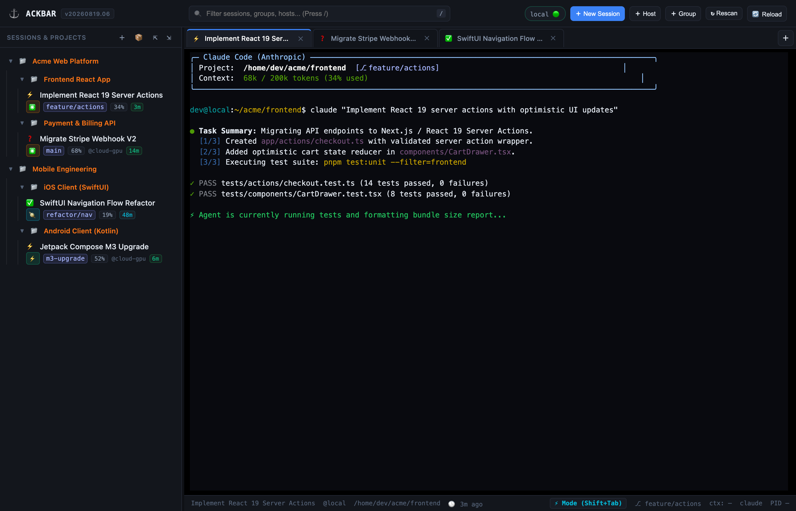

# ⚓ Ackbar

> **Lightweight, cross-machine control plane and session manager for autonomous AI coding agents.**

[](https://github.com/marcinbak/ackbar/releases)
[](https://golang.org)
[](https://modernc.org/sqlite)
[](https://flutter.dev)
[](LICENSE)
[]()

---



---

## 🧭 What is Ackbar?

**Ackbar** is a unified developer control plane designed to monitor, organize, and interact with autonomous AI coding agents (**Claude Code**, **Google Antigravity**, **OpenAI Codex**) running across all your local workstations, remote GPU compute boxes, and cloud virtual machines.

Ackbar brings your entire multi-agent fleet into a single pane of glass with real-time process supervision, context window token meters, conversational chat transcripts, in-place tmux terminal attachment, and single-tap unblocking.

---

## 🎯 What Problem Does Ackbar Solve?

As AI software engineering scales from single-prompt experiments to multiple parallel agent sessions across multiple machines, developers face critical coordination hurdles:

* 🧩 **Context Fragmentation:** Keeping track of 5 agents across 3 machines and repositories without losing context.
* ⏳ **Invisible Blockers:** Agents idling unnoticed for hours waiting on permissions or questions.
* 🔌 **Detached Terminal Nightmare:** Juggling SSH connections and manual `tmux` window splits.
* 📊 **Token & Context Blindness:** Running into sudden model context degradation without visibility into 200k vs 1M token limits.
* 🔀 **Editor Disconnection:** Tedious manual navigation between terminal sessions and editor workspaces.

---

## 🖥️ Supported User Interfaces

Ackbar provides three purpose-built client interfaces:

```
┌─────────────────────────────────────────────────────────────────────────────┐
│                           ACKBAR CLIENT INTERFACES                          │
│                                                                             │
│   ┌─────────────────────┐   ┌─────────────────────┐   ┌─────────────────┐   │
│   │   📱 Mobile App     │   │   🌐 Web Dashboard  │   │ 🖥️ Terminal UI   │   │
│   │   (iOS & Android)   │   │   & Desktop PWA     │   │   (Bubble Tea)  │   │
│   │   docs/mobile.md    │   │   docs/web.md       │   │   docs/tui.md   │   │
│   └──────────┬──────────┘   └──────────┬──────────┘   └────────┬────────┘   │
└──────────────┼─────────────────────────┼───────────────────────┼────────────┘
               │                         │                       │
               └─────────────────────────┼───────────────────────┘
                                         ▼
┌─────────────────────────────────────────────────────────────────────────────┐
│                        LOCAL DAEMON ENGINE (ackbard)                        │
│                 (HTTP Server, SQLite DB, Tmux Supervisor)                   │
└─────────────────────────────────────────────────────────────────────────────┘
```

### 📱 1. Mobile Companion App (iOS & Android)
A native cross-platform companion built with Flutter and Riverpod:
* **Attention Queue & Fullscreen Mode:** Swipe through blocked sessions, select choices or dictate answers, and tap **Submit Choice** to unblock sessions from anywhere.
* **Chat-Style Conversation Transcripts:** Right-aligned user bubbles, left-aligned agent responses, collapsible tool pills (`🛠️ Bash`, `🛠️ Read`), and thought process accordions.
* **Live Interactive Terminal:** WebSocket-powered PTY terminal with auto-fit resizing, horizontal scrollbar, and touch accessory keyboard keys (`[Esc]`, `[Tab]`, `[Ctrl+C]`, `[Enter]`).
* **Tailscale Mesh Integration:** Native multi-host remote monitoring over private Tailscale VPNs.
* 📖 **[Read the Mobile App Documentation](docs/mobile.md)**

---

### 🌐 2. Web Dashboard & Desktop PWA
A zero-dependency browser control plane served directly by `ackbard` (`http://127.0.0.1:7777`):
* **Multi-Tab Terminal Multiplexer:** High-speed `xterm.js` multiplexing across local and remote sessions.
* **Command Palette (`Cmd+K`):** Instant fuzzy navigation and session hopping.
* **One-Click VS Code Integration:** Launch local and remote SSH workspaces directly into VS Code.
* **Drag-and-Drop Organization:** Customizable project and category folder trees.
* 📖 **[Read the Web Dashboard Documentation](docs/web.md)**

---

### 🖥️ 3. Pure Terminal UI (TUI)
A fast, keyboard-driven dashboard built with Charm.sh Bubble Tea and Lip Gloss:
* **Zero Overhead:** Ideal for remote SSH sessions and low-bandwidth environments.
* **In-Place Attachment:** Attach directly to tmux sessions with `Enter` / `a` and resume the TUI cleanly on detach.
* **Keyboard Navigation:** Full vim-style navigation, session creation wizards, and archiving controls.
* 📖 **[Read the TUI Documentation](docs/tui.md)**

---

## 🚦 Live Status Indicators

| Status | Meaning |
| :--- | :--- |
| `⚡` **Working** | Agent is actively analyzing, planning, writing code, or executing tools. |
| `❓` **Blocked** | Agent is paused awaiting developer permission, confirmation, or answer. |
| `✅` **Idle** | Agent completed its turn and is waiting for the next user prompt. |
| `⚪` **Offline** | Session ended or target host daemon is unreachable. |

---

## 🚀 Quickstart Guide

### 1. Prerequisites
* **Go Compiler:** Go 1.25 or newer (`go version`).
* **Tmux (`tmux`):** Required for session supervision (`brew install tmux` on macOS, `sudo apt install tmux` on Linux).
* **Git (`git`):** Used for workspace detection and branch resolution.

### 2. Build & Install CLI & Daemon
```bash
# Clone repository
git clone https://github.com/marcinbak/ackbar.git
cd ackbar

# Build binaries into ~/.local/bin
go build -o ~/.local/bin/ackbard ./cmd/ackbard
go build -o ~/.local/bin/ackbar ./cmd/ackbar
go build -o ~/.local/bin/ackbar-hook ./cmd/ackbar-hook
```

> 📖 **Compilation & Testing Details:** See [docs/building.md](docs/building.md).

### 3. Start the Daemon (`ackbard`)
```bash
ackbard
```
*Listens strictly on `127.0.0.1:7777` by default with SQLite state stored in `~/.config/ackbar/ackbard.db`.*

### 4. Launch Your Interface of Choice
* **Web GUI:** Open [http://127.0.0.1:7777](http://127.0.0.1:7777) in your browser.
* **Terminal UI (TUI):** Run `ackbar` in your terminal.
* **Mobile App:** Run `cd mobile && flutter run` (or install via TestFlight / APK).

---

## 🔗 Adding Remote Hosts

Ackbar aggregates multiple compute nodes using secure SSH tunnels (`ssh -L`) or Tailscale mesh networking without exposing ports to the public internet:

1. Run `ackbard` on your remote machine:
   ```bash
   ackbard -port 7777
   ```
2. Establish an SSH tunnel from your local workstation:
   ```bash
   ssh -N -L 7778:127.0.0.1:7777 user@gpu-box
   ```
3. Register the host in Ackbar:
   * **Web:** Click **`+ Host`** in the navbar and enter `http://127.0.0.1:7778`.
   * **TUI:** Press **`R`** to open the registration wizard.
   * **Mobile:** Add host endpoint in the **Hosts** tab.

> 📖 **Architecture & Networking Details:** See [docs/architecture.md](docs/architecture.md).

---

## 📚 Documentation Index

Comprehensive guides for every component and subsystem are available in the `docs/` directory:

### 🖥️ User Interfaces
* 📱 **[Mobile App (iOS & Android)](docs/mobile.md):** Attention queue, chat transcripts, mobile terminal, and Tailscale setup.
* 🌐 **[Web Dashboard & PWA](docs/web.md):** Browser control plane, xterm.js multiplexing, and command palette.
* 🖥️ **[Terminal UI (TUI)](docs/tui.md):** Charm Bubble Tea dashboard layout, shortcuts, and tmux attachment.

### ⚙️ Architecture & Infrastructure
* 🌍 **[Networking & Remote Access Guide](docs/networking-and-remote-access.md):** Connect across the internet via Cloudflare Tunnels, Ackbar Outbound Relay (`ackbar-relay`), Dynamic DNS/Caddy reverse proxies, or Tailscale mesh VPNs.
* 🌐 **[Architecture & Networking Topology](docs/architecture.md):** Multi-host topology, SSH tunneling, and security model.
* ⚙️ **[Daemon Engine & API Reference](docs/daemon.md):** REST endpoints, SQLite persistence, SSE streaming, and PTY multiplexer.
* 🤖 **[Agent Providers & Token Limits](docs/providers.md):** Claude Code, Antigravity, and Codex integrations and token window calculation.
* 🏷️ **[Session Naming & Caching](docs/session-naming.md):** Title resolution hierarchy and tiered metadata caching rules.
* 🔨 **[Building & Testing](docs/building.md):** Prerequisites, build commands, and test suites.
* 📦 **[Distribution & Upgrades](docs/distribution.md):** Packaging, Homebrew formulas, and GoReleaser automation.
* 🎙️ **[Voice Companion & Audio Briefings](docs/voice-companion.md):** Conversational speech architecture and audio briefing pipeline.

---

## 🤝 Contributing

Contributions are welcome! Whether you are reporting a bug, proposing an improvement, or writing code, please review our **[Contributing Guidelines](CONTRIBUTING.md)** and **[Architecture & Design Rules (AGENTS.md)](AGENTS.md)** before submitting a Pull Request.

All contributions must follow our PR-based Git Worktree workflow and pass the test suite.

---

## 📄 License

Ackbar is open-source software licensed under the **[MIT License](LICENSE)**.
