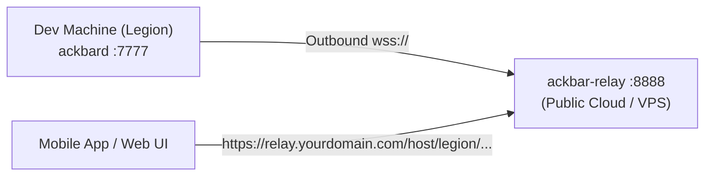

# Networking & Remote Access Guide

Project Ackbar supports multiple secure, production-grade networking topologies to connect your Mobile App (iOS & Android), Web Dashboard, and TUI to remote `ackbard` daemons across the internet.

Whether your dev machine is behind a strict office firewall, mobile hotspot, home CGNAT, or accessible over a mesh VPN, Ackbar offers 4 flexible connection options.

---

## 1. Connectivity Topology Matrix

| Method | NAT / Firewall Traversal | Public IP Needed? | Setup Complexity | Best For |
| :--- | :--- | :--- | :--- | :--- |
| **Option 1: Cloudflare Tunnel** | ✅ Automatic Outbound | ❌ No | ⭐ Minimal (2 mins) | Zero open ports, enterprise DDoS/WAF, free public HTTPS |
| **Option 2: Ackbar Relay** | ✅ Automatic Outbound | ❌ No (Relay has IP) | ⭐⭐ Simple (1 binary) | Self-hosted rendezvous, no 3rd-party SaaS accounts |
| **Option 3: Reverse Proxy + DDNS** | ⚠️ Port forwarding required | ✅ Yes | ⭐⭐⭐ Intermediate | Custom domains, self-hosted Caddy/Nginx |
| **Option 4: Tailscale Mesh VPN** | ✅ Direct WireGuard P2P | ❌ No | ⭐ Minimal | Private team mesh, zero public internet exposure |

---

## 2. API Token Authentication (`ACKBAR_TOKEN`)

When exposing `ackbard` beyond a private local network, you can enable token-based authentication.

### Enabling Authentication on the Daemon

Set the `ACKBAR_TOKEN` environment variable or start `ackbard` with the `-token` flag:

```bash
# Via environment variable
export ACKBAR_TOKEN="sec_dev_98fbc834a71"
ackbard

# Or via CLI flag
ackbard -token "sec_dev_98fbc834a71"
```

> [!NOTE]
> If `ACKBAR_TOKEN` is unset or empty (default), `ackbard` operates in open local/mesh mode for zero-friction local development and Tailscale meshes.

### Supported Authentication Formats

Clients can authenticate with any of the following:
1. **HTTP Header:** `Authorization: Bearer <token>`
2. **Custom Header:** `X-Ackbar-Token: <token>`
3. **URL Query Parameter:** `?token=<token>` (used automatically for EventSource SSE streams and WebSocket terminal connections).

---

## 3. Setup Option 1: Cloudflare Tunnels (Recommended for Zero-Open-Ports)

Cloudflare Tunnels create a persistent outbound TLS connection from your dev machine to the Cloudflare global edge network.

### Quick Start (Quick Tunnel — Instant URL)

```bash
# 1. Install cloudflared on remote machine
# macOS: brew install cloudflared
# Linux: apt install cloudflared

# 2. Start tunnel pointing to ackbard (port 7777)
cloudflared tunnel --url http://127.0.0.1:7777
```

Cloudflare will output a public HTTPS URL (e.g. `https://random-words.trycloudflare.com`).

### Production Custom Subdomain (e.g. `legion.yourdomain.com`)

1. Authenticate `cloudflared login`.
2. Create named tunnel: `cloudflared tunnel create ackbar-legion`.
3. Configure `~/.cloudflared/config.yml`:
   ```yaml
   tunnel: ackbar-legion
   credentials-file: /home/dev4u/.cloudflared/<tunnel-id>.json
   ingress:
     - hostname: legion.yourdomain.com
       service: http://127.0.0.1:7777
     - service: http_status:404
   ```
4. Run tunnel as a system service: `cloudflared tunnel run ackbar-legion`.
5. In the **Ackbar Mobile App** or **Web UI**, add host:
   * **Host:** `https://legion.yourdomain.com`
   * **Token:** Your `ACKBAR_TOKEN` secret.

---

## 4. Setup Option 2: Ackbar Outbound Relay (`ackbar-relay`)

If you prefer self-hosting your own rendezvous server without relying on Cloudflare, use `ackbar-relay`.



### Step 1: Deploy `ackbar-relay` on a Public VPS or Cloud Container

```bash
# Build relay binary
go build -o ~/.local/bin/ackbar-relay ./cmd/ackbar-relay

# Run relay server (e.g. on port 8888 with optional secret)
ackbar-relay -port 8888 -secret "relay-master-key"
```

### Step 2: Connect `ackbard` Outbound to the Relay

On your dev machine (e.g., Legion behind NAT/firewall):

```bash
# Connect ackbard outbound to your relay
ackbard -relay "wss://relay.yourdomain.com/v1/relay/tunnel" -relay-secret "relay-master-key"
```

### Step 3: Access via Mobile or Web Client

* **Daemon URL in Mobile App:** `https://relay.yourdomain.com/host/legion`
* **API Token:** Your `ACKBAR_TOKEN` secret.

The relay automatically multiplexes all REST API requests, SSE real-time event streams, and interactive PTY terminal WebSockets through the single persistent outbound tunnel!

---

## 5. Setup Option 3: Dynamic DNS + Reverse Proxy (Caddy / Nginx)

If your dev machine or router has a public IPv4/IPv6 address and port forwarding is enabled:

### Caddy Example (`Caddyfile`)

```caddy
legion.duckdns.org {
    reverse_proxy 127.0.0.1:7777
}
```

Caddy automatically provisions and renews Let's Encrypt TLS certificates.

---

## 6. Setup Option 4: Tailscale Mesh VPN & WireGuard

For private, peer-to-peer connectivity across devices without exposing any ports to the public internet:

1. Install Tailscale on your dev machines, laptop, and phone.
2. Ensure devices are on the same Tailnet (e.g. `100.117.71.84`).
3. In the mobile app, enter the Tailscale IP `100.117.71.84`.
4. Native direct connection works out of the box with zero token requirements or with optional `ACKBAR_TOKEN`.

---

## 7. Configuring Clients

### Mobile Companion App (iOS & Android)

1. Open **Hosts** tab $\rightarrow$ tap **Add Host** (+).
2. Enter the host endpoint (e.g., `legion.yourdomain.com` or `100.x.y.z`).
3. If token authentication is enabled, enter your secret in **Auth Token / API Key**.
4. Tap **Connect & Add**. The host will show a `Token Auth Active` badge.

### Web Dashboard & PWA

* **Direct URL:** `https://legion.yourdomain.com?token=sec_dev_98fbc834a71`
* **Prompt:** If unauthenticated, the Web GUI will prompt for your token and store it securely in browser `localStorage`.
